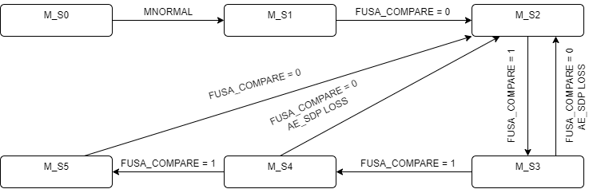
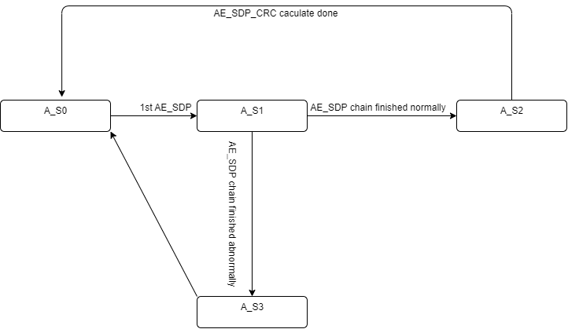

# DP Automotive Extension Services Architecture Specification

## Function of Profile 0

| AE Spec Feature                                                        |  RTL change plan                                                                                                                                                                                                                                                                                                                                                                                                                                                                                                                                                                                                                                                                                                                | Normative shall be  implemented  | Note                                                                                                                                                                                                          |
|---------------------------------------------------------------------------|---------------------------------------------------------------------------------------------------------------------------------------------------------------------------------------------------------------------------------------------------------------------------------------------------------------------------------------------------------------------------------------------------------------------------------------------------------------------------------------------------------------------------------------------------------------------------------------------------------------------------------------------------------------------------------------------------------------------------------|-------------------------------------|---------------------------------------------------------------------------------------------------------------------------------------------------------------------------------------------------------------|
| Uncompressed Pixel Frame CRC or Reconstructed Pixel CRC per Slice Column  | CRC-32 engine 48-bit container for each pixel                                                                                                                                                                                                                                                                                                                                                                                                                                                                                                                                                                                                                                                                                | Normative                           | 4 pipe 48bit(192 bit)  CRC-32                                                                                                                                                                                 |
| Compressed Pixel Frame CRC                                                | CRC-32 engine data repacker for 48-bit container                                                                                                                                                                                                                                                                                                                                                                                                                                                                                                                                                                                                                                                                             | Optional                            |                                                                                                                                                                                                               |
| CRC on defined SDPs                                                       | CRC-32 engine data repacker for 48-bit container SDP Types to be used in CRC_SDP_DATA calculation  01h  02h  04h  05h  06h  07h  0Fh through 08h  10h  11h  20h (VSC_EXT_VESA except AE_SDP) 21h  87h through 81h                                                                                                                                                                                                                                                                                                                                                                                                                                                                     | Normative                           | A split SDP may start transmission in HBlank during the vertical active period of Frame N-1,  and complete in vertical blank period of Frame N.  Such an SDP would belong to the context of AE SDP Frame N-1. |
| AE_SDP/CRC on AE_SDP                                                      | Buffer for AE_SDP chain CRC-32 engine data repacker for 48-bit container                                                                                                                                                                                                                                                                                                                                                                                                                                                                                                                                                                                                                                                  | Normative                           | AE_SDP is distinguished from other VSC_EXT_VESA via DB3 and DB4                                                                                                                                               |
| CRC on MSA                                                                | CRC-32 engine data repacker for 48-bit container                                                                                                                                                                                                                                                                                                                                                                                                                                                                                                                                                                                                                                                                             | Normative                           |                                                                                                                                                                                                               |
| CRC on Regions-of-Interest Support (Max  16)                           | CRC-32 engine 48-bit container for each pixel Hcnt, Vcnt for ROI                                                                                                                                                                                                                                                                                                                                                                                                                                                                                                                                                                                                                                                          | Normative                           | ROI Region Overlap Four Times may require 4 parallel CRC engines 4 parallel CRC engines are enough for all ROI CRC calculations We can just use 16 parallel CRC engines what is “Min ROI Req of 0” ? |
| Frame drop/repeat and  timeout monitoring check                        | FSM                                                                                                                                                                                                                                                                                                                                                                                                                                                                                                                                                                                                                                                                                                                             | Normative                           |                                                                                                                                                                                                               |
| CRC, Frame ID, and Timeout checks                                         | FSM                                                                                                                                                                                                                                                                                                                                                                                                                                                                                                                                                                                                                                                                                                                             | Normative                           |                                                                                                                                                                                                               |
| DPCD                                                                      | 00A00h to 00A09h  :  DP AE Interrupt Registers  00A10h to 00A13h  :  VESA AE DPCD Capabilities - Safety  00A20h to 00A21h  :  VESA AE DPCD Capabilities - Security  00A2Ah            :  VESA AE DPCD Capabilities - Superframe  00A30h to 00A52h  :  VESA AE DPCD Configuration - Safe State  00A60h to 00A80h  :  VESA AE DPCD Configuration – Superframe  00A90h to 00B11h  :  VESA AE DPCD Configuration - ROI  00B20h            :  VESA AE DPCD Functional State Status  00B30h to 0B34h   :  VESA AE Security Status  00B40h to 00B4Ah  :  VESA AE DPCD Status - FRAME_ID  00B50h to 00B58h  :  DPCD Sink AE_SDP Status Compare  00B60h to 00B65h  :  DPCD Sink AE_SDP Debug Registers  | Normative                           | 358 DPCD regs total, may need new page                                                                                                                                                                        |
| DP AE Safety Self-Test                                                    |                                                                                                                                                                                                                                                                                                                                                                                                                                                                                                                                                                                                                                                                                                                                 | Optional                            | The DP Sink device may not display any test pattern information on the screen during this initialization. How does sink recognize this state                                                               |
| Super Frames                                                              |                                                                                                                                                                                                                                                                                                                                                                                                                                                                                                                                                                                                                                                                                                                                 | Optional                            | Branch should support                                                                                                                                                                                         |

## Main State

| Main State/Event                                   |  Description                                                                                                                                                                                                                                                                                         |
|----------------------------------------------------|------------------------------------------------------------------------------------------------------------------------------------------------------------------------------------------------------------------------------------------------------------------------------------------------------|
| M_S0:STATE_0_AE_DEVICE_CAP_STATUS                  | Set the status bit AE_DEVICE_CAP_STATUS = 0                                                                                                                                                                                                                                                          |
| M_S1:STATE_2_AE_SDP_RX_STATUS                      | Set the status bit AE_DEVICE_CAP_STATUS = 1                                                                                                                                                                                                                                                          |
| M_S2:STATE_3A_WAIT_AE_SDP_FUSA_COMPARE_ENABLE D | Setting status bit AE_SDP_RX_STATUS = 1                                                                                                                                                                                                                                                              |
| M_S3                                               | 1st FUSA_COMPARE = 1 received                                                                                                                                                                                                                                                                        |
| M_S4                                               | 2nd FUSA_COMPARE = 1 received                                                                                                                                                                                                                                                                        |
| M_S5:STATE_4_PROTECTED                             | 3rd FUSA_COMPARE = 1 received Set the AE_SDP_FUSA_COMPARE_ENABLED = 1 CRC, Frame ID, Frame drop/repeat and timeout monitoring check ROI CRC check based on the ROI_MASK of the previous 2, the previous 1 and current frame Soft Failure Fault Detection Hard Failure Fault Detection |
| Transition from any State to M_S0               | Train state is not MNORMAL No jump when VFAIL?                                                                                                                                                                                                                                                    |
| Transition M_S0:M_S1                               | Train state is MNORMAL                                                                                                                                                                                                                                                                               |
| Transition M_S1:M_S2                               | FUSA_COMPARE = 0 received                                                                                                                                                                                                                                                                            |
| Transition M_S2:M_S3                               | 1st FUSA_COMPARE = 1 received                                                                                                                                                                                                                                                                        |
| Transition M_S3:M_S4                               | 2nd FUSA_COMPARE = 1 received                                                                                                                                                                                                                                                                        |
| Transition M_S4:M_S5                               | 3rd FUSA_COMPARE = 1 received                                                                                                                                                                                                                                                                        |
| Transition M_S5:M_S2                               | FUSA_COMPARE = 0 received                                                                                                                                                                                                                                                                            |
| Transition M_S3,M_S4:M_S2                          | AE_SDP loss FUSA_COMPARE = 0 received                                                                                                                                                                                                                                                             |

## AE_SDP Chain Update State

| AE_SDP Chain update State/Event      |  Description                                                                                                                                  |
|--------------------------------------|-----------------------------------------------------------------------------------------------------------------------------------------------|
| A_S0                                 | IDLE                                                                                                                                          |
| A_S1                                 | 1st AE_SDP received Waiting other AE_SDP chain Latch AE_DPCD config                                                                     |
| A_S2                                 | AE_SDP valid and update                                                                                                                       |
| A_S3                                 | AE_SDP error                                                                                                                                  |
| Transition from any State to A_S0 | Main State is M_S0                                                                                                                            |
| Transition A_S0:A_S1                 | 1st AE_SDP received Check HB1(20h), HB2[7](MIDDLE_OF_CHAINING=1) && !C_S2, HB3[4:0](Packet Sequence =0） DB0,DB1,DB2,DB3,DB4 DB5,DB6 |
| Transition A_S1:A_S2                 | AE_SDP chain finished normally Check HB1(20h), HB2[7](MIDDLE_OF_CHAINING=0), HB3[4:0](Packet Sequence == (1 + INT(  (4N+ 4NR+3) /32)）  |
| Transition A_S1:A_S3                 | AE_SDP chain error Packet Sequence mismatch HB2[7](MIDDLE_OF_CHAINING=0), HB3[4:0](Packet Sequence != (1 + INT(  (4N+ 4NR+3) /32)）  |
| Transition A_S2,A_S3:A_S0            | vcnt==1, 1st active line                                                                                                                      |
| AE_SDP_DATA_LATCH                    | A_S0 exit to A_S1 VSC_EXT_VESA_UPDATE && A_S1)                                                                                             |
| AE_DPCD_UPDATE                       | A_S1 entry                                                                                                                                    |
| AE_SDP_UPDATE                        | A_S2 entry                                                                                                                                    |
| AE_SDP_LOSS                          | (vcnt==1) && A_S0 \|\| A_S3 entry                                                                                                             |
| AE_SDP_CRC caculate start            | A_S1 entry                                                                                                                                    |
| ALL_CRC_CHECK                        | AE_SDP_CRC caculate done                                                                                                                      |
