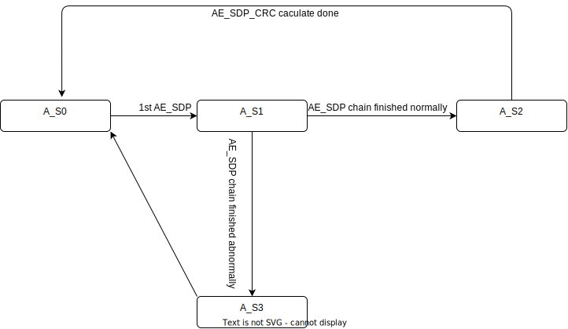

# DP Automotive Extension Services Architecture Specification
- [DP Automotive Extension Services Architecture Specification](#dp-automotive-extension-services-architecture-specification)
  - [Function of Profile 0](#function-of-profile-0)
  - [Main State](#main-state)
  - [AE\_SDP Chain Update State](#ae_sdp-chain-update-state)
  - [AE\_SDP Chain CRC Calculate](#ae_sdp-chain-crc-calculate)
  - [Defined SDPs CRC Map State](#defined-sdps-crc-map-state)
  - [Defined SDP CRC Calculate](#defined-sdp-crc-calculate)
  - [ROI CRC Calculate](#roi-crc-calculate)
  - [CRC Check Contrl](#crc-check-contrl)
  - [Frame Counting and Timeout Monitoring](#frame-counting-and-timeout-monitoring)
  - [Debug Counter](#debug-counter)

## Function of Profile 0

| AE Spec<br>Feature                                                           | RTL change plan                                                                                                                                                                                                                                                                                                                                                                                                                                                                                                                                                                                                                                                                                                                                                               | Normative shall be <br>implemented | Note                                                                                                                                                                                                          |
| ---------------------------------------------------------------------------- | ----------------------------------------------------------------------------------------------------------------------------------------------------------------------------------------------------------------------------------------------------------------------------------------------------------------------------------------------------------------------------------------------------------------------------------------------------------------------------------------------------------------------------------------------------------------------------------------------------------------------------------------------------------------------------------------------------------------------------------------------------------------------------- | ---------------------------------- | ------------------------------------------------------------------------------------------------------------------------------------------------------------------------------------------------------------- |
| Uncompressed Pixel Frame CRC ~~or Reconstructed Pixel CRC per Slice Column~~ | CRC-32 engine<br>48-bit container for each pixel                                                                                                                                                                                                                                                                                                                                                                                                                                                                                                                                                                                                                                                                                                                              | Normative                          | 4 pipe 48bit(192 bit)  CRC-32                                                                                                                                                                                 |
| ~~Compressed Pixel Frame CRC~~                                               | CRC-32 engine<br>data repacker for 48-bit container                                                                                                                                                                                                                                                                                                                                                                                                                                                                                                                                                                                                                                                                                                                           | Optional                           |                                                                                                                                                                                                               |
| CRC on defined SDPs                                                          | CRC-32 engine<br>data repacker for 48-bit container<br>SDP Types to be used in CRC_SDP_DATA calculation <br>01h <br>02h <br>04h <br>05h <br>06h <br>07h <br>0Fh through 08h <br>10h <br>11h <br>20h (VSC_EXT_VESA except AE_SDP)<br>21h <br>87h through 81h                                                                                                                                                                                                                                                                                                                                                                                                                                                                                                                   | Normative                          | A split SDP may start transmission in HBlank during the vertical active period of Frame N-1,  and complete in vertical blank period of Frame N.  Such an SDP would belong to the context of AE SDP Frame N-1. |
| AE_SDP/CRC on AE_SDP                                                         | Buffer for AE_SDP chain<br>CRC-32 engine<br>data repacker for 48-bit container                                                                                                                                                                                                                                                                                                                                                                                                                                                                                                                                                                                                                                                                                                | Normative                          | AE_SDP is distinguished from other VSC_EXT_VESA via DB3 and DB4                                                                                                                                               |
| CRC on MSA                                                                   | CRC-32 engine<br>data repacker for 48-bit container                                                                                                                                                                                                                                                                                                                                                                                                                                                                                                                                                                                                                                                                                                                           | Normative                          |                                                                                                                                                                                                               |
| CRC on Regions-of-Interest Support (Max <br>16)                              | CRC-32 engine<br>48-bit container for each pixel<br>Hcnt, Vcnt for ROI                                                                                                                                                                                                                                                                                                                                                                                                                                                                                                                                                                                                                                                                                                        | Normative                          | ROI Region Overlap Four Times may require 4 parallel CRC engines<br>4 parallel CRC engines are enough for all ROI CRC calculations<br>We can just use 16 parallel CRC engines                                 |
| Frame drop/repeat and <br>timeout monitoring check                           | FSM                                                                                                                                                                                                                                                                                                                                                                                                                                                                                                                                                                                                                                                                                                                                                                           | Normative                          |                                                                                                                                                                                                               |
| CRC, Frame ID, and Timeout checks                                            | FSM                                                                                                                                                                                                                                                                                                                                                                                                                                                                                                                                                                                                                                                                                                                                                                           | Normative                          |                                                                                                                                                                                                               |
| DPCD                                                                         | 00A00h to 00A09h  :  <br>DP AE Interrupt Registers <br>00A10h to 00A13h  :  <br>VESA AE DPCD Capabilities - Safety <br>00A20h to 00A21h  :  <br>VESA AE DPCD Capabilities - Security <br>00A2Ah            :  <br>VESA AE DPCD Capabilities - Superframe <br>00A30h to 00A52h  :  <br>VESA AE DPCD Configuration - Safe State <br>00A60h to 00A80h  :  <br>VESA AE DPCD Configuration – Superframe <br>00A90h to 00B11h  :  <br>VESA AE DPCD Configuration - ROI <br>00B20h            : <br>VESA AE DPCD Functional State Status <br>00B30h to 0B34h   :  <br>VESA AE Security Status <br>00B40h to 00B4Ah  :  <br>VESA AE DPCD Status - FRAME_ID <br>00B50h to 00B58h  :  <br>DPCD Sink AE_SDP Status Compare <br>00B60h to 00B65h  :  <br>DPCD Sink AE_SDP Debug Registers | Normative                          | 358 DPCD regs total, may need new page                                                                                                                                                                        |
| DP AE Safety Self-Test                                                       |                                                                                                                                                                                                                                                                                                                                                                                                                                                                                                                                                                                                                                                                                                                                                                               | Optional                           | The DP Sink device may not display any test pattern information on the screen during this initialization.<br>How does sink recognize this state                                                               |
| ~~Super Frames~~                                                             |                                                                                                                                                                                                                                                                                                                                                                                                                                                                                                                                                                                                                                                                                                                                                                               | Optional                           | Branch should support                                                                                                                                                                                         |

## Main State


| Main State/Event                                   | Description                                                                                                                                                                                                                                                                                          |
| -------------------------------------------------- | ---------------------------------------------------------------------------------------------------------------------------------------------------------------------------------------------------------------------------------------------------------------------------------------------------- |
| M_S0:STATE_0_AE_DEVICE_CAP_STATUS                  | Set the status bit AE_DEVICE_CAP_STATUS = 0                                                                                                                                                                                                                                                          |
| M_S1:STATE_2_AE_SDP_RX_STATUS                      | Set the status bit AE_DEVICE_CAP_STATUS = 1                                                                                                                                                                                                                                                          |
| M_S2:STATE_3A_WAIT_AE_SDP_FUSA_COMPARE_ENABLE<br>D | Setting status bit AE_SDP_RX_STATUS = 1                                                                                                                                                                                                                                                              |
| M_S3                                               | 1st FUSA_COMPARE = 1 received                                                                                                                                                                                                                                                                        |
| M_S4                                               | 2nd FUSA_COMPARE = 1 received                                                                                                                                                                                                                                                                        |
| M_S5:STATE_4_PROTECTED                             | 3rd FUSA_COMPARE = 1 received<br>Set the AE_SDP_FUSA_COMPARE_ENABLED = 1<br>CRC, Frame ID, Frame drop/repeat and timeout monitoring check<br>ROI CRC check based on the ROI_MASK of the previous 2, the previous 1 and current frame<br>Soft Failure Fault Detection<br>Hard Failure Fault Detection |
| Transition from<br>any State to M_S0               | Train state is not MNORMAL                                                                                                                                                                                                                                                                           |
| Transition M_S0:M_S1                               | Train state is MNORMAL                                                                                                                                                                                                                                                                               |
| Transition M_S1:M_S2                               | FUSA_COMPARE = 0 received                                                                                                                                                                                                                                                                            |
| Transition M_S2:M_S3                               | 1st FUSA_COMPARE = 1 received                                                                                                                                                                                                                                                                        |
| Transition M_S3:M_S4                               | 2nd FUSA_COMPARE = 1 received                                                                                                                                                                                                                                                                        |
| Transition M_S4:M_S5                               | 3rd FUSA_COMPARE = 1 received                                                                                                                                                                                                                                                                        |
| Transition M_S5:M_S2                               | FUSA_COMPARE = 0 received<br>MNORMAL && VFAIL                                                                                                                                                                                                                                                        |
| Transition M_S3,M_S4:M_S2                          | AE_SDP_LOSS<br>FUSA_COMPARE = 0 received<br>MNORMAL && VFAIL                                                                                                                                                                                                                                         |

## AE_SDP Chain Update State



| AE_SDP Chain update State/Event      | Description                                                                                                                                                                                                                                                                                                   |
| ------------------------------------ | ------------------------------------------------------------------------------------------------------------------------------------------------------------------------------------------------------------------------------------------------------------------------------------------------------------- |
| A_S0                                 | IDLE                                                                                                                                                                                                                                                                                                          |
| A_S1                                 | 1st AE_SDP received<br>Waiting other AE_SDP chain<br>Latch AE_DPCD config                                                                                                                                                                                                                                     |
| A_S2                                 | AE_SDP chain finished normally                                                                                                                                                                                                                                                                                |
| A_S3                                 | AE_SDP chain finished abnormally                                                                                                                                                                                                                                                                              |
| Transition from<br>any State to A_S0 | Main State is M_S0                                                                                                                                                                                                                                                                                            |
| Transition A_S0:A_S1                 | 1st AE_SDP received<br>vblank<br>VSC_EXT_VESA_UPDATE (HB1(20h))<br>HB2\[7](MIDDLE_OF_CHAINING=1)<br>HB3[4:0](Packet Sequence =0）<br>{DB0,DB1,DB2}\=={3A,02,92} (IEEE OUI/CID)<br>{DB3,DB4}== {01,00} (Extended VESA SDP)<br>DB5,DB6 (Length of Following Extended VESA SDP <br>Data)<br>!C_S2<br>!AE_SDP_DUR |
| Transition A_S1:A_S2                 | AE_SDP chain finished normally<br>!AE_SDP chain error && VSC_EXT_VESA_UPDATE && HB2\[7](MIDDLE_OF_CHAINING=0)                                                                                                                                                                                                 |
| Transition A_S1:A_S3                 | AE_SDP chain finished abnormally<br>AE_SDP chain error && VSC_EXT_VESA_UPDATE && HB2\[7](MIDDLE_OF_CHAINING=0)<br>(vcnt==1)<br>timeout (Larger than vblank)                                                                                                                                                   |
| Transition A_S3:A_S0                 | always                                                                                                                                                                                                                                                                                                        |
| Transition A_S2:A_S0                 | M_S4 \|\| M_S5 : AE_SDP_CRC caculate done<br>others : always                                                                                                                                                                                                                                                  |
| AE_SDP chain error                   | set when A_S1: <br>Packet Sequence mismatch (Packet Sequence != AE_SDP write tail/32)<br>HB2\[7](MIDDLE_OF_CHAINING=1), HB3[4:0](Packet Sequence >= (1 + INT( <br>(4N+ 4NR+3) /32)）<br>HB2\[7](MIDDLE_OF_CHAINING=0), HB3[4:0](Packet Sequence != (1 + INT( <br>(4N+ 4NR+3) /32)）<br>clear :<br>A_S0        |
| AE_DPCD_UPDATE                       | Transition A_S0:A_S1                                                                                                                                                                                                                                                                                          |
| AE_SDP_DATA_LATCH                    | For every 32-bytes sdp<br>VSC_EXT_VESA_UPDATE && （next state is (A_S1\|\|A_S2))                                                                                                                                                                                                                              |
| AE_SDP_DATA_UPDATE                   | Transition A_S2:A_S0                                                                                                                                                                                                                                                                                          |
| AE_SDP_UPDATE                        | AE_SDP_DATA_UPDATE_1p<br>Used to transition the main state                                                                                                                                                                                                                                                    |
| AE_SDP_DUR                           | set:<br>Transition A_S0:A_S1<br>clear:<br>vcnt==1<br>Timeout<br>M_S0                                                                                                                                                                                                                                          |
| AE_SDP_LOSS                          | (A_S3 \|\| !AE_SDP_DUR && (vcnt==1)) && (M_S3 \|\| M_S4 \|\| M_S5)                                                                                                                                                                                                                                            |
| ALL_CHECK                            | CRC, Frame ID, and Timeout checks<br>AE_SDP_UPDATE_delay && M_S5                                                                                                                                                                                                                                              | F |

- [x] AE_SDP chaind error occurred, the whole chain will be ignored.
  
  > If the entirety of the chained VSC_EXT_VESA SDPs are not received in time (i.e., the chained 
SDP with HB2[7] = 0 is not received in time), the DP Sink device shall discard the incomplete 
chained SDPs.

- [ ] Receiving AE_SDP outside of the timeout window is not effective (TIMEOUT_WINDOW_MIN, TIMEOUT_WINDOW_MAX)

## AE_SDP Chain CRC Calculate

**Utilizes the existing RXSDP_REV module. Create cache queue to receive 32 bytes of AE_SDP data at a time and send 24 bytes of data at a time for CRC calculation**

> After all the N data bytes are consumed, a padding of X times 0 shall be shifted into the CRC engine, such that (N*8 + X) % 48 = 0.


|                   | run                                                                                                                                                                                                                                                          | clear                                                     | increment | initial |
| ----------------- | ------------------------------------------------------------------------------------------------------------------------------------------------------------------------------------------------------------------------------------------------------------ | --------------------------------------------------------- | --------- | ------- |
| AE_SDP write head | AE_SDP_DATA_LATCH                                                                                                                                                                                                                                            | Transition from<br>any State to A_S0                      | 32        | 31      |
| AE_SDP write tail | AE_SDP_DATA_LATCH                                                                                                                                                                                                                                            | Transition from<br>any State to A_S0                      | 32        | 0       |
| AE_SDP read head  | M_S4 \|\| M_S5<br>normal_read = (AE_SDP read head < AE_SDP write tail) && (AE_SDP read head < 32+4N(1+R))<br>pad_read =  (AE_SDP read tail < 32+4N(1+R)) && (AE_SDP write tail >= 32+4N(1+R)) && ！normal_read<br>read_done = AE_SDP read tail >= 32+4N(1+R) | Transition from<br>any State to A_S0<br>!(M_S4 \|\| M_S5) | 24        | 23      |
| AE_SDP read tail  | M_S4 \|\| M_S5<br>normal_read = (AE_SDP read head < AE_SDP write tail) && (AE_SDP read head < 32+4N(1+R))<br>pad_read =  (AE_SDP read tail < 32+4N(1+R)) && (AE_SDP write tail >= 32+4N(1+R)) && ！normal_read<br>read_done = AE_SDP read tail >= 32+4N(1+R) | Transition from<br>any State to A_S0<br>!(M_S4 \|\| M_S5) | 24        | 0       |

| AE_SDP_CRC caculate data                                                                                                                              | AE_SDP_CRC caculate done | AE_SDP_CRC caculate valid                                                                                   |
| ----------------------------------------------------------------------------------------------------------------------------------------------------- | ------------------------ | ----------------------------------------------------------------------------------------------------------- |
| pad_read_mask = ~(24{1}<<(32+4N(1+R)-AE_SDP read tail))<br>if (normal_read) DB[read tail+:24]<br>else if (pad_read) DB[read tail+:24] & pad_read_mask | read_done                | 4{normal_read}<br>{\|pad_read_mask[18+:6]\|pad_read_mask[12+:6]\|pad_read_mask[6+:6],\|pad_read_mask[0+:6]} |

**The mask here refers to the byte mask**

## Defined SDPs CRC Map State

```verilog
always @(posedge LCLK or negedge RSTB)
begin
    if(!RSTB)
        CNT <= #1 10'b0;
    else if(ECC_END)
        CNT <= #1 10'b0;
    else if(ECC_START)
        CNT <= #1 10'b1;
    else if(ECC_SRDY)
        CNT <= #1 CNT + 1'b1;
end
wire SD_DATA = ONELANE ? (CNT >= 10'h2) : 
                         (CNT != 10'h0);
```

| Defined SDPs CRC Map State/Event     | Description                                                                                                                                                                                                                 |
| ------------------------------------ | --------------------------------------------------------------------------------------------------------------------------------------------------------------------------------------------------------------------------- |
| D_S0                                 | IDLE                                                                                                                                                                                                                        |
| D_S1                                 | AE_SDP chain                                                                                                                                                                                                                |
| D_S2                                 | CRC calulated                                                                                                                                                                                                               |
| Transition from<br>any State to D_S0 | M_S0 \|\| M_S1 \|\| M_S2                                                                                                                                                                                                    |
| Transition D_S0:D_S1                 | Transition C_S0:C_S1<br><br>((!ONElANE && (CNT == 1)) \|\|<br>ONELANE && (CNT==2)) && <br>(HB1 == 'h20) && C_S1                                                                                                             |
| Transition D_S0:D_S2                 | ((!ONElANE && (CNT == 1)) \|\|<br>ONELANE && (CNT\==2)) && <br>(HB1 != 'h20) && <br>(HB1 == defined)<br><br>((!ONElANE && (CNT == 1)) \|\|<br>ONELANE && (CNT==2)) && <br>(HB1 == 'h20) && C_S2<br><br>Transition C_S0:C_S2 |
| Transition D_S1,D_S2:D_S0            | ECC_END <br>ECC_START                                                                                                                                                                                                       |

| AE_SDP check State/Event             | Description                                                                                                                                                                                                          |
| ------------------------------------ | -------------------------------------------------------------------------------------------------------------------------------------------------------------------------------------------------------------------- |
| C_S0                                 | IDLE/CHECK                                                                                                                                                                                                           |
| C_S1                                 | AE_SDP chain                                                                                                                                                                                                         |
| C_S2                                 | not AE_SDP chain                                                                                                                                                                                                     |
| Transition from<br>any State to C_S0 | M_S0                                                                                                                                                                                                                 |
| Transition C_S0:C_S1                 | !ONElANE && (CNT == 3)<br>ONELANE && (CNT \== 5)<br>HB1(20h), HB2\[7](MIDDLE_OF_CHAINING=1), HB3[4:0](Packet Sequence =0）<br>{DB0,DB1,DB2} \== {3A,02,92} (IEEE OUI/CID)<br>{DB3,DB4}== {01,00} (Extended VESA SDP) |
| Transition C_S0:C_S2                 | !ONElANE && (CNT == 3)<br>ONELANE && (CNT==5)<br>HB1(20h), HB2\[7](MIDDLE_OF_CHAINING=1), HB3[4:0](Packet Sequence \==0）<br>{DB3,DB4}\!= {01,00} (Extended VESA SDP)                                                |
| Transition C_S1,C_S2:C_S0            | (ECC_END && HB1(20h) && HB2\[7]\==0) \|\| vcnt==1 \|\| timeout                                                                                                                                                       |

## Defined SDP CRC Calculate

- **Create a 48bytes queue to repack the sdp data**
- **Sdp head first caches at the end of the queue**
- **Accepts up to 16 bytes of sdp data at a time for 4 lanes**


|                     | run                                                                                                                        | clear                             | increment(4/2/1) | initial |
| ------------------- | -------------------------------------------------------------------------------------------------------------------------- | --------------------------------- | ---------------- | ------- |
| NOAE_SDP write head | ODD_ECC_SRDY & SD_DATA & !D_S1                                                                                             | Transition D_S0:D_S1<br>last_read | 16/8/4           | 15/7/3  |
| NOAE_SDP write tail | ODD_ECC_SRDY & SD_DATA & !D_S1                                                                                             | Transition D_S0:D_S1<br>last_read | 16/8/4           | 0       |
| NOAE_SDP read head  | normal_read = !(NOAE_SDP read head >= NOAE_SDP write tail && NO_WRAP_AROUND) &&D_S2<br>last_read = Transition D_S2:D_S0 1p | last_read                         | 24               | 19      |
| NOAE_SDP read tail  | normal_read = !(NOAE_SDP read head >= NOAE_SDP write tail && NO_WRAP_AROUND) &&D_S2<br>last_read = Transition D_S2:D_S0 1p | last_read                         | 24               | 44      |

| NOAE_SDP_CRC caculate data                                                                                                                                         | NOAE_SDP_CRC caculate done | NOAE_SDP_CRC caculate valid                                                                                     |
| ------------------------------------------------------------------------------------------------------------------------------------------------------------------ | -------------------------- | --------------------------------------------------------------------------------------------------------------- |
| last_read_mask = 24{1}>>(NOAE_SDP read head-NOAE_SDP write tail+1)<br>if (normal_read) DB[read tail+:24]<br>else if (last_read) DB[read tail+:24] & last_read_mask | last_read 1p               | 4{normal_read}<br>{\|last_read_mask[18+:6]\|last_read_mask[12+:6]\|last_read_mask[6+:6],\|last_read_mask[0+:6]} |

**The mask here refers to the byte mask**

## ROI CRC Calculate

```verilog
assign HWIDTH_SUB = (|HWIDTH[1:0])? {2'b0, HWIDTH[15:2]} : {2'b0, HWIDTH[15:2]}-1'b1;
assign HLEFT = ROI_ORIGIN_PIXEL_OFFSET;
assign HRIGHT = (ROI_ORIGIN_PIXEL_OFFSET + ROI_WIDTH - 1'b1);
assign VLEFT = ROI_ORIGIN_LINE_OFFSET;
assign VRIGHT = (ROI_ORIGIN_LINE_OFFSET + ROI_HEIGHT - 1'b1);
assign V_VALID = VCNT <= VRIGHT && VCNT >= VLEFT;
assign H_VALID_MID = HCNT < HRIGHT[15:2] && HCNT > HLEFT[15:2];
assign H_VALID_LEFT = HCNT == HLEFT[15:2];
assign H_VALID_RIGHT = HCNT == HRIGHT[15:2];
```

|      | run                                | clear                                 | increment | initial |
| ---- | ---------------------------------- | ------------------------------------- | --------- | ------- |
| HCNT | SFIFO_WREN0                        | LS_VB<br>(HCNT == HWIDTH_SUB) & run   | 1         | 0       |
| VCNT | (HCNT == HWIDTH_SUB) & SFIFO_WREN0 | LS_VB<br>(VCNT == (VHEIGHT -1)) & run | 1         | 0       |

| ROI_CRC caculate valid                                                                                                                                                                                                                                                   |
| ------------------------------------------------------------------------------------------------------------------------------------------------------------------------------------------------------------------------------------------------------------------------ |
| V_VALID && H_VALID_MID : 4{SFIFO_WREN0}<br>V_VALID && H_VALID_LEFT : 4{SFIFO_WREN0}<<(HLEFT[1:0])<br>00:1111<br>01:1110<br>10:1100<br>11:1000<br>V_VALID && H_VALID_RIGHT : 4{SFIFO_WREN0}>>(~HRIGHT[1:0]))<br>00:0001<br>01:0011<br>10:0111<br>11:1111<br>OTHERS : 0000 |

## CRC Check Contrl


| CRC check                                | Enable                                                | clear               | Update                    | Compare                                                                                                                                                                                                                                                                                                                                                                                                          |
| ---------------------------------------- | ----------------------------------------------------- | ------------------- | ------------------------- | ---------------------------------------------------------------------------------------------------------------------------------------------------------------------------------------------------------------------------------------------------------------------------------------------------------------------------------------------------------------------------------------------------------------- |
| Uncompressed Pixel Frame CRC             | M_S3 \|\| M_S4 \|\| M_S5                              | update \|\| !Enable | Vblank up && Enable       | ALL_CHECK && M_S5                                                                                                                                                                                                                                                                                                                                                                                                |
| CRC on defined SDPs except AE_SDP        | M_S3 \|\| M_S4 \|\| M_S5                              | update \|\| !Enable | (Vblank && D_S0) up       | ALL_CHECK && M_S5                                                                                                                                                                                                                                                                                                                                                                                                |
| CRC on AE_SDP                            | M_S4 \|\| M_S5                                        | update \|\| !Enable | AE_SDP_CRC caculate done  | ALL_CHECK && M_S5                                                                                                                                                                                                                                                                                                                                                                                                |
| CRC on MSA                               | M_S3 \|\| M_S4 \|\| M_S5                              | update \|\| !Enable | Vblank up && Enable       | ALL_CHECK && M_S5                                                                                                                                                                                                                                                                                                                                                                                                |
| CRC on Regions-of-Interest               | ROI_COUNT_SET && ROI_EN && (M_S3 \|\| M_S4 \|\| M_S5) | update \|\| !Enable | Vblank up && Enable       | ROI CRC check based on the ROI_MASK of the previous 2, the previous 1 and current frame<br>ROI_COUNT_SET && ROI_EN && M_S5 && (ROI_MASK_EN) && ALL_CHECK<br>if（AE_SDP_UPDATE) ROI_MASK_EN <= ROI_MASK_P2 & ROI_MASK_P1 & {DB27, DB26}<br>if（AE_SDP_UPDATE \|\| AE_SDP_LOSS) ROI_MASK_P2 <= ROI_MASK_P1<br>if（AE_SDP_UPDATE) ROI_MASK_P1 <= {DB27, DB26} <br>else if (AE_SDP_loss)  ROI_MASK_P1 <= ROI_MASK_EN |
| Reconstructed Pixel CRC per Slice Column | M_S3 \|\| M_S4 \|\| M_S5                              | update \|\| !Enable | Vblank up_dealy && Enable | ALL_CHECK && M_S5                                                                                                                                                                                                                                                                                                                                                                                                |
| Compressed Pixel Frame CRC               | M_S3 \|\| M_S4 \|\| M_S5                              | update \|\| !Enable | Vblank up && Enable       | ALL_CHECK && M_S5                                                                                                                                                                                                                                                                                                                                                                                                |

## Frame Counting and Timeout Monitoring

|                                  | run                                                                                             | load/value                  | clear                                                                 | increment | initial |
| -------------------------------- | ----------------------------------------------------------------------------------------------- | --------------------------- | --------------------------------------------------------------------- | --------- | ------- |
| FRAME_ID Cnt                     | M_S5 && Vblank up                                                                               | ALL_CHECK/FRAME_ID received | !M_S5                                                                 | 1         | 0       |
| AE_SDP Timeout Cnt               | M_S5 && every 10us && AE_SDP Timeout Cnt <= TIMEOUT_WINDOW_MAX                                  |                             | ALL_CHECK<br>AE_SDP Timeout Cnt > TIMEOUT_WINDOW_MAX<br>!(M_S5)       | 1         | 0       |
| Soft Fail Cnt for CRC, FRAME_ID  | ALL_CHECK && NOT_EQ<br>AE_SDP_LOSS                                                              |                             | !M_S5<br>Soft Fail Cnt > MAX_THRES<br>SOFT_FAIL_COUNTER_RESET(00A32h) | 1         | 0       |
| Soft Fail Cnt for AE_SDP Timeout | ALL_CHECK && AE_SDP Timeout Cnt < TIMEOUT_WINDOW_MIN<br>AE_SDP Timeout Cnt > TIMEOUT_WINDOW_MAX |                             | !M_S5<br>Soft Fail Cnt > MAX_THRES<br>SOFT_FAIL_COUNTER_RESET(00A32h) | 1         | 0       |

**When Timeout Window Max occurs, AE_SDP is still received before vactive, which can cause an additional Timeout Window Min error**

## Debug Counter

> DEBUG_FUSA_CONFIG_FRAME_ID_INTERVAL
>
> This is a debug register used by software to synchronize the reading of the internal debug status table.
>
> In normal operations, this register is set to 0 and interrupts are only 
generated when an error occurs.  
>
> When DEBUG_FUSA_CONFIG_FRAME_ID_INTERVAL is programmed to a value other than 0, an internal DP AE Sink counter increments every FRAME_ID until the count matches the interval and an interrupt is triggered to signal to the DP AE Source that values are available.
>
> When the internal counter matches, the entire internal debug status table is updated and held static until the next interval is reached when it
is updated again.  The internal counter is reset to 0 once the debug values are latched and the next interval count is started.

|                                         | run                                                          | clear                                                                           | increment | initial |
| --------------------------------------- | ------------------------------------------------------------ | ------------------------------------------------------------------------------- | --------- | ------- |
| DP_AE_FUSA_CONFIG_FRAME_ID_INTERVAL Cnt | M_S5 && Vblank up && DP_AE_FUSA_CONFIG_FRAME_ID_INTERVAL !=0 | DP_AE_FUSA_CONFIG_FRAME_ID_INTERVAL Cnt \== DP_AE_FUSA_CONFIG_FRAME_ID_INTERVAL | 1         | 0       |